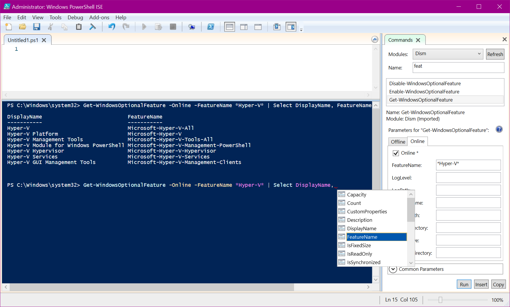
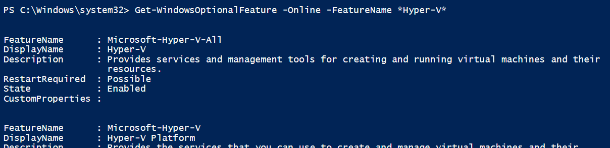
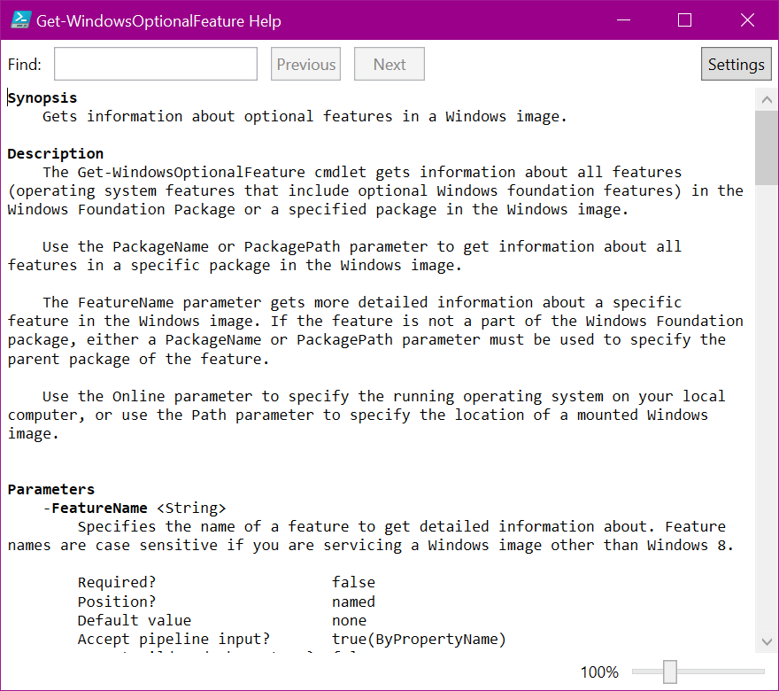

# A Different Shell

The POSIX ideas have gotten us very far, but: let's imagine what the next step will look like, and when should we move beyond them. My thinking here was definitely inspired by how an Internet advert company entirely abandoned the POSIX file API in its distributed systems.

[TL;DR: The commandline editor is the easiest place to start](#concrete-suggestions).

Note: haven't yet expanded on all the ideas from the thread this had started from: https://twitter.com/luisbruno/status/1353317050698104832.

I want to trigger some of these thoughts about what could a more advanced world look like, so I'll exemplify with PowerShell's _Integrated Scripting Environment_[1] -- but don't get hung-up on the exact features; think instead of the mental model that allowed someone to come up with these technologies in the first place.

I want you to think about how the screenshot below shows components and concepts we don't have in Linux:

- All available commands are self-documenting, as can be seen on the sidebar to the right:
  + Implying there's machine-parseable metadata for all arguments of a command, as well as for its output.
- Structured output with metadata, allowing:
  + `Select-Object` can extract only some fields of the output.
  + A command's output can be rendered differently depending on its context (see the 2nd screenshot).
  + Auto-complete for the second command is driven by the metadata exported from the first command.
- The command hasn't run, and that's not a command line being color-highlighted using terminal escapes:
  + It's a smart editor, more comparable to content-editable HTML than to a byte-stream.
  + Think how that changes how the autocomplete would be implemented, compared to how a regular byte-stream shell would be able to implement this.
- That commandline could be running remotely on a server, without losing any functionality described above.



Without filtering through `Select-Object`, each "row" returned by the `Get-WindowsOptionalFeature` command gets rendered over multiple lines -- shows the "rendering" of the output depending on the context, as referred to above.



For extra brownie points, there's even manpages for every command:



## Amazon's successes

Before I explain further, I want to reason about two examples of our industry moving away from older habits (POSIX and otherwise), both which Amazon deserves all the credit for:

1. EC<sup>2</sup> moved the bar on provisioning virtual-machines.
2. S3 has a widely-mimicked API.

### EC<sup>2</sup>

Our industry owes a debt to Amazon for single-handledly raising the bar of what is expected of any entrant into the industry -- although the industry had taken up the habit of deploying an application/service into a virtual-machine, we got something better from Amazon, the expectation that creating and managing such a fleet of VMs would not be a manual process:

1. Folks who need a VM call an API, instead of having to file a ticket.
2. Turn around time on VM creating is measured in minutes if that long, instead of multiple days.
3. Everything in this process is automated, instead of requiring a human to intervene.

### S3

Out in the industry there's some toying around with the idea of abandoning the POSIX file API (up to a point): consider the success of S3, despite its API being nothing like the POSIX file API. Both Ceph and Min.IO provide an open-source clustered filesystem which can be accessed via an API that mimicks Amazon's S3.

But this is not something as pervasive as the change brought about by EC2 -- if it were, the distributed CockroachDB would be able to rely on all its users having a distributed filesystem available in their cluster; but instead it still has to rely on mirroring the data from an extant replica's `PersistentVolume`, instead of having its data stored persistently in a cluster's extant filesystem.

## Proposal

### Long-lived sessions and `tmux`

Above I explained a wholly different world-view than the one Linux users currently inhabit. Before I give practical suggestions, I want to give a long-lived `tmux` session as an example: although the OSI model has a _Session_ layer (#5, right above the bytestream/TCP layer), we haven't made use of that concept at all.

```sh
# In fact, we haven't yet gotten rid of decades-old existing abstractions that are by now entirely useless: I cannot fathom having 9.6 kilo-bauds in my SSH connection to a server in Finland:

hel1-1> stty
speed 9600 baud; line = 0;
-brkint -imaxbel
```

Consider that most text-UI programs (like `weechat`, or `tmux` itself) render their own panes, split windows that each buffers and wraps whatever text is put there by the respective program.

 It operates on top of a byte-stream protocol, without a layer of abstraction on top that actually represents said session. , but is indeed the _Session_ layer and represents the long-lived nature of a `tmux` session, but all output is still marshalled as a combination of byte-streams, with sundry escape sequences to manage both colorization and ancillary "terminal" chrome (like window titles), and some Unix signals thrown in e.g. `SIGWINCH`.

 That latter is the solitary example of an out-of-band comms method that I can think of in SSH connections: there's a `SSH_MSG_CHANNEL_REQUEST` message with a sub-type of `signal` that proxies signals received on the client side to the processes running on the host, such as a shell or a `tmux`.

 A terrible example of in-band escape sequence mushing is that some terminals allow us to transfer image data embedded between escape characters:

 - https://sw.kovidgoyal.net/kitty/graphics-protocol.html#the-graphics-escape-code.
 - https://iterm2.com/documentation-images.html (also used by hterm in Chrome OS's SSH).

For more on the terribleness of in-band signalling, there's been plenty of security bugs triggered by escape sequences being mishandled -- also, the AT&T experiences from back before I was born.

### Concrete suggestions

Considering what I wrote above, what can we do to make progress while avoiding to boil the ocean and/or trying to remove the pseudo-tty abstraction from Linux?

I think the best place to start is that smart command-line editor -- it's a modal interface, even if not widely recognized as such. This makes us very free to make changes while "composing" a command for future execution, since we always terminate out of that mode after issuing the command -- there's no reason why the remote side (or the local system) has to know how exactly a command has been edited.

However, the auto-complete function relies on the relevant `/etc/bash_completion.d/` scripts running interactively; finding a way to create an LSP-like system to execute such scripts (again, using out-of-band signalling) would be a another great improvement.

## Further "out-there" suggestions

### Cockpit shell

TBD.

- Per {directory,command}-tuple, having a list of environment and commandline option overrides:
  + These must somehow be made visible when inputting a command. Having hovering UI "chips" denoting the overrides is probably the easiest way to show that.
  + Also consider that this is what's known as a modal interface -- there's history of airliner pilots finding such modal-changes surprising.

### Operations-specific hardware

TBD.

- Oncall board:
  + Conceptually very much like an analog audio mixer, where each vertical row maps to e.g. one geographic region.
  + Allows issuing a specific set of commands by fiddling with hardware buttons:
    - A cluster drain would be: a) turn a rotary encoder to select what fraction of traffic to deliver there, and b) clicking said encoder to issue the relevant command.
  + Could also have minor monitoring functions e.g. the metric being used for balancing traffic (CPU usage? Free RAM?)

## Footnotes

[1]: Funnily enough, ISE is ~~deprecated~~ in maintenance mode and the suggested alternative isn't ready yet (VS Code with the PowerShell extension).
